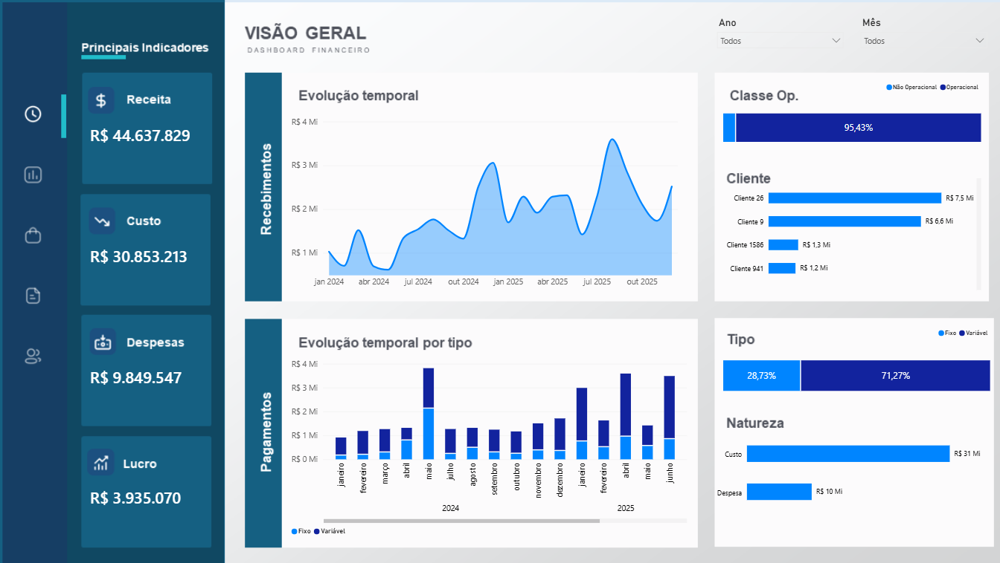

# 💰 Financial Dashboard

---

# 📖 Sobre

Dashboard financeiro desenvolvido para análise dos principais indicadores econômicos da empresa, permitindo acompanhar receitas, custos, despesas, lucro e evolução financeira.

---

# 🎯 Objetivos

- Consolidar indicadores financeiros
- Monitorar fluxo financeiro
- Avaliar custos e despesas
- Apoiar decisões estratégicas

---

# 📊 KPIs

- Receita
- Custos
- Despesas
- Lucro
- Recebimentos
- Pagamentos
- Classe Operacional
- Natureza Financeira
- Evolução Mensal
- Tipo de Receita

---

# 🛠 Tecnologias

- Power BI
- Excel
- Power Query
- DAX

---

# 🚀 Competências

- Financial Analytics
- Dashboard Executivo
- Data Visualization
- Business Intelligence
- DAX
